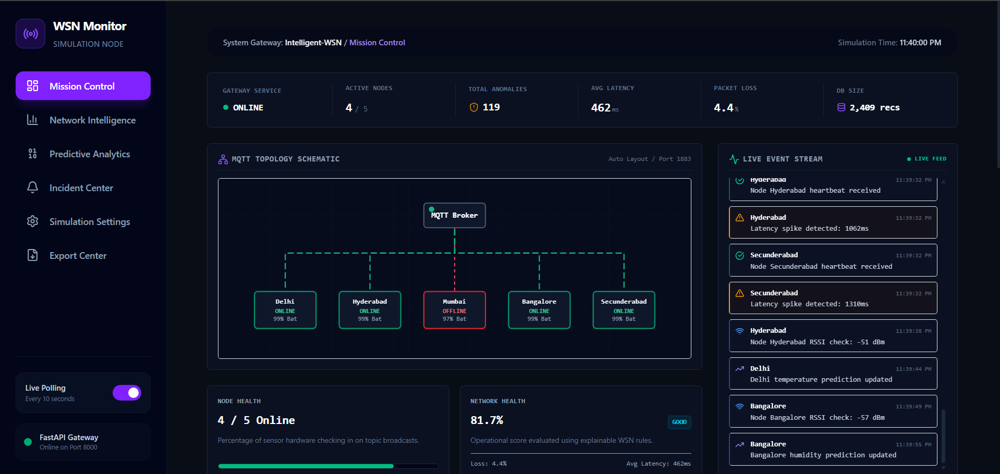
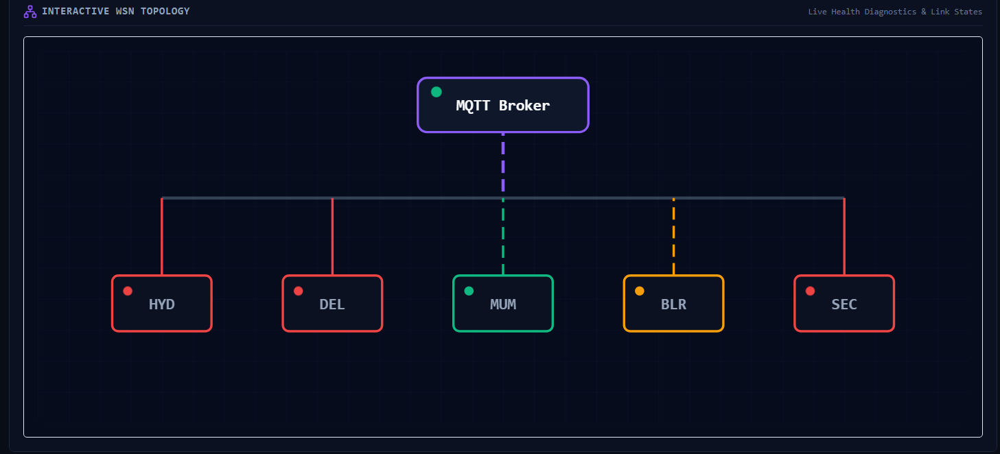
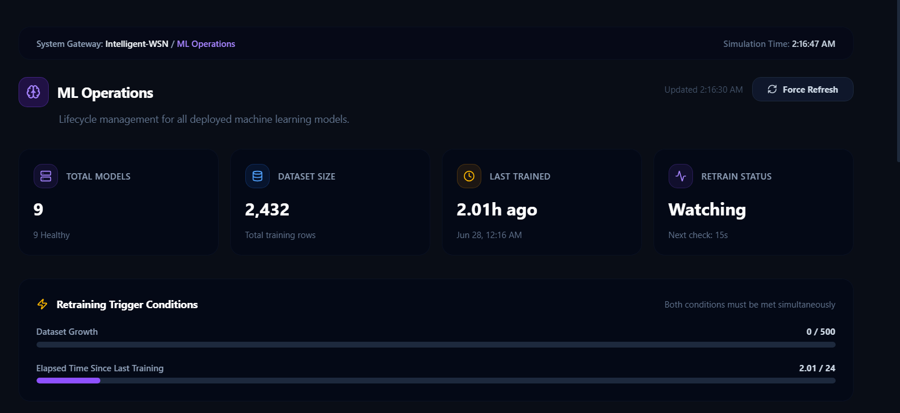
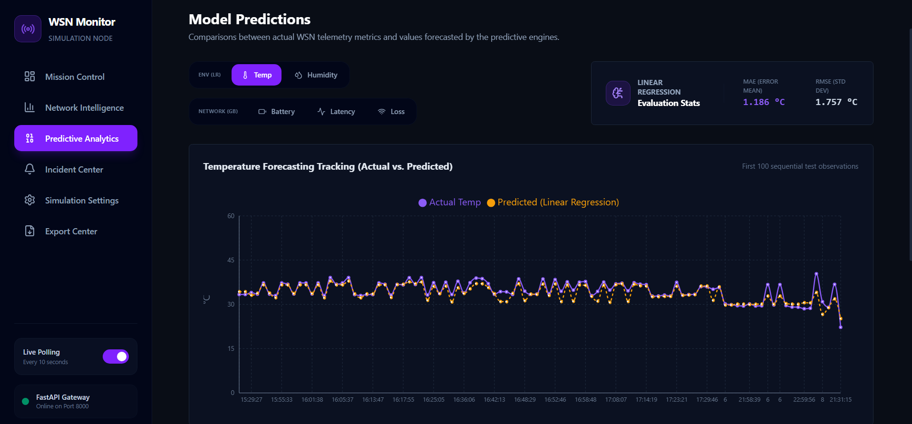
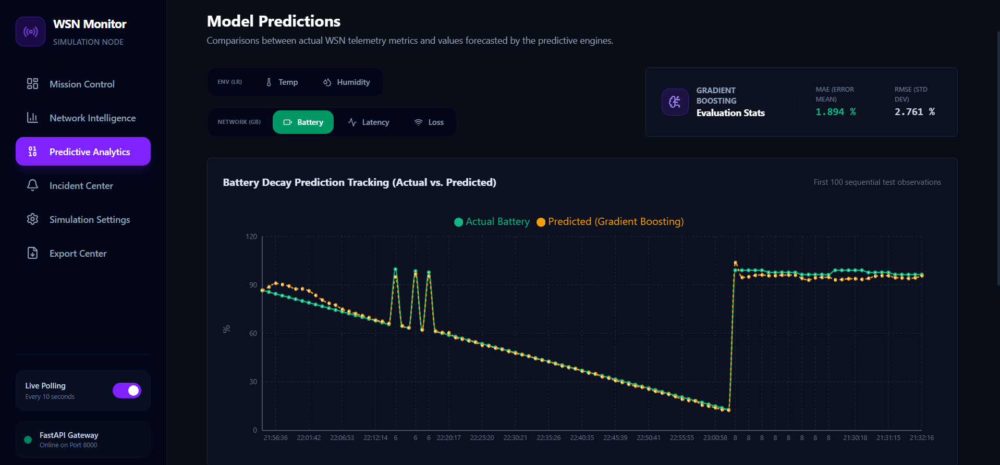

# Intelligent Wireless Sensor Network (WSN) Platform & Simulation

[](https://fastapi.tiangolo.com/)
[](https://react.dev/)
[](https://mqtt.org/)
[](https://visualstudio.microsoft.com/)
[](https://platformio.org/)

An enterprise-grade, simulation-first IoT platform for distributed Wireless Sensor Networks (WSNs). The system is built around a decoupled architecture where the network protocols, API endpoints, and dashboards remain identical, while the telemetry generation source evolves across three distinct implementation phases.

---

## 📅 Phase-Wise Evolution & Roadmap

### 🟢 Phase 1: Pure Software Simulation (Completed)
- **Concept**: Model the physical and environmental behaviors of WSN grids entirely in software before working with hardware interfaces.
- **Implementation**: Five Python virtual node scripts (`src/node.py`) representing regional hubs. Each node queried the **OpenWeather API** to seed telemetry with real diurnal weather conditions (temperature, humidity, pressure).
- **Synthetic Metrics**: Implemented math-based decay equations for Gaussian RSSI noise, linear battery discharge per transmission, and normal-distribution latency spikes.
- **Protocol**: Message transmission routed through a local Mosquitto broker on wildcard topics using city names as identifiers (e.g. `wsn/{city}/data`).

---

### 🔵 Phase 2: Virtual Embedded Hardware Simulation (Completed)
- **Concept**: Retain all downstream code bases (API, ML pipelines, frontend) but replace the Python simulation scripts with embedded C++ firmware executing inside simulated microcontrollers.
- **Implementation**: Generic firmware written in C++ running on simulated **ESP32** microchips inside the **Wokwi** browser sandbox. DHT22 (GPIO 4) and BMP180 (I2C 21/22) sensors simulated on the canvas.
- **Dynamic Node Registry & MAC Identity**: Decoupled locations from firmware. The board queries its unique hardware **eFuse MAC address** on boot (`node_id = "mac"`). The backend Node Registry (`configs/nodes_registry.json`) dynamically binds the MAC address to city locations, coordinates, and coordinates.
- **Digital Twin Management Layer**: Created an in-memory Digital Twin layer persisted to `data/twins/twins_state.json` via atomic swaps, acting as an inter-process bridge.
- **Continuous Learning Pipeline**: Background training manager daemon (`training_manager.py`) monitoring dataset growth (500 rows) and elapsed time (24h) to trigger automatic model updates.
- **Validation Gates & MLOps**: Added a champion/candidate validation step using $R^2$ fit tests and a custom **ML Operations** NOC dashboard.

---

### 🟡 Phase 3: Physical Hardware Deployment (Future Work)
- **Concept**: Flash the validated Phase 2 C++ firmware directly onto real physical microchips and wire them to environmental sensors.
- **Implementation**: Flashing identical C++ code using **PlatformIO** onto physical **ESP32 DevKitC** boards. Wiring physical DHT22 and BMP180 sensor breakouts.
- **Zero Downstream Changes**: Real boards publish matching JSON packages over home/office Wi-Fi. The REST API and React dashboard serve physical node measurements with zero changes to code.

---

## 📸 Dashboard Showcase

### 1. Mission Control NOC View
Visualizes connection links and gateway statuses, routing dynamic communication paths from the MQTT broker down to geographical points.
<p align="center">
  
</p>

### 2. Interactive SVG WSN Topology
Nodes color-code dynamically: Green (Healthy), Yellow (Degraded battery, signal noise, latency spikes), and Red (watchdog timeout OFFLINE states).
<p align="center">
  
</p>

### 3. Machine Learning Operations (MLOps)
Visualizes model versions, validation benchmarks ($R^2$, MAE, RMSE), training histories, and live trigger accumulation progress.
<p align="center">
  
</p>


4. ### Environmental Prediction Engine

Linear Regression models are used to forecast environmental telemetry and compare predicted values against actual observations.

<p align="center">
  
</p>


5. ### Network Parameter Prediction Engine

Gradient Boosting models forecast battery behavior, latency, and packet loss to support predictive maintenance and fault prevention.

<p align="center">
  
</p>

---


## Core Dashboard Features

- Real-time MQTT network monitoring
- Interactive SVG topology visualization
- Multi-node sensor simulation
- Live event and incident stream
- Isolation Forest anomaly detection
- Environmental forecasting
- Network parameter prediction
- **ML Operations**: model lifecycle visualization, training history, evaluation metrics
- **Autonomous Continuous Learning**: configurable retraining triggers with live progress tracking
- Explainable Network Health Index (NHI)
- Fault diagnostics and watchdog monitoring
- Configurable simulation parameters
- Historical analytics and export center

---

## 2. Why This Project Exists

Traditional Wireless Sensor Network (WSN) development is heavily constrained by a hardware-first workflow, presenting several engineering challenges:
1.  **Debugging Bottlenecks**: Pinpointing failures (e.g., packet losses or memory leaks) on bare-metal microcontrollers (such as ESP8266 or Arduino boards) is slow, often requiring hardware-level instrumentation.
2.  **RF Noise and Propagation Variables**: Natural indoor and outdoor RF interference introduces unpredictable packet dropouts and signal attenuation that are difficult to reproduce under laboratory conditions.
3.  **High Prototyping Overhead**: Procuring physical hardware, custom shields, and environmental sensors across multiple regional points is costly and scales poorly during early architectural iterations.

This platform resolves these issues by dividing the project into a three-step progression:

$$\text{Software Simulation (Phase 1)} \Longrightarrow \text{Simulated Hardware (Phase 2)} \Longrightarrow \text{Physical Embedded Hardware (Phase 3)}$$

Developers can prototype, test regression models, and tune alarm thresholds in a sandbox environment before transitioning to physical hardware.

---

## 3. Design Philosophy

*   **Simulation First**: Validate software interfaces, ML pipelines, and data normalization before physical hardware integration.
*   **Decoupled Modularity**: Telemetry sources, brokers, database ingestion, APIs, and client UIs exist as independent services.
*   **Hardware Abstraction**: Node interactions are standardized via common JSON structures sent over MQTT topics. The subscriber backend does not distinguish between a Python virtual process, a Wokwi simulation, or a physical ESP8266.
*   **Explainable AI (XAI)**: Prefers deterministic, clear equations for operational metric scoring over black-box ML metrics, ensuring dashboard actions are explainable to operators.
*   **Frontend/Backend Separation**: Utilizes stateless REST gateways and asynchronous event loops, keeping front-end clients independent of backend database locks.

---

## 4. Three-Phase Development Model

### Phase 1: Software Simulation (100% Completed)
*   **Virtual Nodes**: Simulates 5 regional weather monitoring nodes (Bangalore, Delhi, Hyderabad, Mumbai, Secunderabad) running as independent Python processes.
*   **OpenWeather API**: Fetches real-world meteorology data to provide baseline ambient conditions.
*   **Synthesized Metrics**: Simulates battery decay (idle discharge, heartbeat checks, data writes), RSSI signal attenuation, latency spikes, and sequence-based packet dropouts.
*   **MQTT Broker**: Connects nodes to a Mosquitto server, routing status heartbeats and telemetry data.
*   **FastAPI & React**: Exposes clean API endpoints and renders a real-time dark-mode NOC control board.

### Phase 2: Wokwi Web-based Hardware Simulation (100% Completed)
*   **Virtual Board Compilation**: Python virtual nodes are replaced with simulated ESP32 microcontroller boards running inside **Wokwi**'s browser environment.
*   **Firmware Porting**: Embedded C/C++ scripts are executed on simulated microchips, establishing virtual WiFi (`Wokwi-GUEST`) links to connect directly to the MQTT client.
*   **Infrastructure Reuse**: Telemetry payloads are published to a public broker (`broker.hivemq.com`) under a unique namespace (`wsn_ahana_2026`). The Python backend subscriber, FastAPI server, and React dashboard ingest the data seamlessly.

### Phase 3: Real Hardware Deployment (Future)
*   **Physical Deployment**: Firmware is flashed onto physical **ESP8266** or **ESP32** microcontroller chips.
*   **Sensor Integration**: Integrates physical DHT11/BMP280 sensor shields to register ambient temperature, humidity, and barometric pressure.
*   **Field Operations**: Establishes local Wi-Fi links to publish live telemetry directly to the centralized gateway.

---

## 5. System Architecture

The architecture routes meteorological payloads and network diagnostics parameters from simulated or physical sensor nodes through MQTT brokers to local file databases, digital twins, REST services, and client dashboards.

### Architecture Layout Diagram
```text
  [ DHT22 / BMP180 Sensors ]
              │
              ▼ (Generic C++ Firmware on ESP32)
  [ Simulated or Physical Nodes ]  ◄── (Dynamic eFuse MAC Address Resolution)
              │
              ▼ MQTT Topics (wsn_ahana_2026/<node_id>/data & /status) over Port 1883
  [ Public MQTT Broker ] (broker.hivemq.com)
              │
              ▼
  [ Python Subscriber Backend ]
          ├── Ingestion Subscriber  ──► [ Node CSV Files & Rotating Logs ]
          ├── Master Dataset Merger ──► [ data/processed/wsn_dataset.csv ]
          ├── Digital Twin Manager  ──► [ data/twins/twins_state.json ] (Atomic file-bridge)
          ├── Stateful Watchdog     ──► [ Check-in timers & offline flag alerts ]
          └── Fault Diagnostics     ──► [ Alert transitions logged to alerts.log ]
                  │
                  ▼
  [ Machine Learning & Analytics ]
          ├── Unsupervised Anomalies (Isolation Forest)
          ├── Environmental Predictions (Linear Regression Temp/Humidity)
          ├── Network Parameters Predictions (Linear Regression vs Gradient Boosting)
          └── Continuous Retraining  ──► [ training_manager.py ] (Validation-gated daemon)
                  │
                  ▼
  [ FastAPI REST Server Gateway ] ◄── (Exposes telemetry, digital twins, & models endpoints)
          │
          ▼
  [ React WSN Control Room Dashboard ] (Mission Control topology + ML Operations view)
```

### Architectural Layer Explanations
1.  **Telemetry Source Layer**: Physical or virtual nodes publishing JSON packets containing sensor values and network metrics (battery, RSSI, latency). Supports MAC-based automatic identity resolution.
2.  **Communication Layer (MQTT)**: Routes heartbeat packets over `wsn_ahana_2026/<node_id>/status` and full data records over `wsn_ahana_2026/<node_id>/data` via `broker.hivemq.com`.
3.  **Ingestion & Watchdog Layer**: Written in [`backend.py`](file:///d:/Projects/College/Wireless-Sensor-Network/src/backend.py). Implements multithreaded subscription clients, rotates logging handlers, updates real-time CSV rows, handles node timeouts, and pushes state changes to the **Digital Twin Manager**.
4.  **Digital Twin Manager**: Maintained in `src/utils/digital_twin_manager.py`. Persists a thread-safe software representation of each node inside `data/twins/twins_state.json` via atomic swaps, allowing decoupled processes (backend and API) to share states.
5.  **Analytics & Retraining Layer**: Runs `src/ml/training_manager.py` as a daemon process. Evaluates retraining conditions dynamically and performs validation-gated candidate-to-champion promotions. Saves regression estimators to `models/` and anomaly audits to `data/processed/`.
6.  **REST API Layer (FastAPI)**: Serves clean Pydantic routes, handles input validations, and maps CORS headers for Vite clients. Exposes twins and model-monitoring endpoints.
7.  **Client Dashboard**: React SPA rendering interactive topology components, time-series graphs, alarm registers, and the **ML Operations** page.

### Portfolio Demo Mode Replay Flow
For production staging or public portfolio deployments where active background services (like MQTT brokers, Python node simulators, and OpenWeather APIs) cannot run continuously, the backend implements a stateless **Demo Mode Replay Engine** in [`demo.py`](file:///d:/Projects/College/Wireless-Sensor-Network/src/api/demo.py).

When active, it intercepts data queries and serves replayed historical telemetry from existing dataset logs:
```text
  [ Node CSV Files & Rotating Logs ]
                  │
                  ▼ (Stateless Replay Modulo Index based on System Clock)
  [ Demo Mode Interceptor ] ◄── (Bypasses MQTT, Ingestor, and simulator nodes)
                  │
                  ▼ (Overwrites timestamps dynamically with current epoch times)
  [ FastAPI REST Server Gateway Routing ]
                  │
                  ▼
  [ React WSN Control Room Dashboard ]
```
1.  **Status Check**: The interceptor verifies if Demo Mode is enabled by checking the `DEMO_MODE` environment variable (highest priority) or checking `"demo_mode"` inside `configs/settings.json`.
2.  **Tick Calculation**: Calculates a virtual replay tick index based on the wall-clock time divided by the configured `polling_interval` (default 10s):
```text
tick = floor(unix_time / polling_interval)
```
3.  **Cyclic Telemetry Selection**: Sequentially loops through each city's historical dataset using a modulo wrap-around index:
    
```text
index = tick % dataset_length
```
4.  **Live Watchdog Syncing**: Automatically replaces historical timestamp columns with the current system time. This keeps nodes marked as `ONLINE` (green connectivity links) under the dashboard's 45-second watchdog check-in threshold.

---

## 6. Features Checklist

### Simulation Layer
*   [x] Multi-node virtual simulation (Delhi, Hyderabad, Mumbai, Bangalore, Secunderabad)
*   [x] OpenWeather API telemetry seeding
*   [x] MQTT publication architecture (heartbeats vs data packets)
*   [x] Packet loss simulation based on sequence tracking gaps
*   [x] Latency simulation using normal distributions and maximum limits
*   [x] Battery depletion simulation (state-based idle, heartbeat, and transmission decay)
*   [x] Battery wrap-around reset modeling (simulates manual field swaps)
*   [x] RSSI distance-attenuation simulation with Gaussian noise
*   [x] Stateless Demo Mode Portfolio Replay Engine

### Backend & Ingestion
*   [x] Multithreaded message ingestion subscribers
*   [x] Automatic startup CSV schema migrations (migrates historical columns)
*   [x] Rotating logging handlers (`backend.log` and `alerts.log`)
*   [x] Real-time master dataset auto-merger (`wsn_dataset.csv`)
*   [x] Stateful diagnostics alarm tracker (avoids duplicate warnings)
*   [x] Watchdog timeout loops flagging node `OFFLINE` status

### Machine Learning
*   [x] Unsupervised anomaly detection (Isolation Forest contamination = 5%)
*   [x] Linear Regression Temperature forecasting model ($R^2 \approx 0.81$, MAE $\approx 0.99^\circ\text{C}$)
*   [x] Linear Regression Humidity forecasting model ($R^2 \approx 0.57$, MAE $\approx 8.03\%$)
*   [x] Network Battery decay prediction (Gradient Boosting $R^2 \approx 0.97$, MAE $\approx 2.49\%$)
*   [x] Network Packet Loss prediction (Gradient Boosting $R^2 \approx 0.75$, MAE $\approx 0.37\%$)
*   [x] Deterministic Network Health Index (NHI) scoring engine

### Frontend & UI
*   [x] Single-page React dashboard built with Tailwind CSS v4 and Recharts
*   [x] Interactive WSN SVG topology mapping live nodes and link states
*   [x] SVG dash-offset line flow animations indicating active packet streams
*   [x] Interactive tooltip hover cards detailing node metrics
*   [x] Live scrolling operations event stream sidebar
*   [x] Route code-splitting (lazy loading) and Suspense transitions
*   [x] Visited route caching mechanisms avoiding DOM redraw cycles
*   [x] Modular loading skeletons (Cards, Tables, Charts, Topologies)
*   [x] Forced 2.0-second delay spinners for settings saves and reloads

---

## 7. Machine Learning & Diagnostics Pipelines

### A. Anomaly Detection
*   **Model**: `IsolationForest` (contamination = 5%)
*   **Inputs**: `temp`, `humidity`, `pressure`, `wind_speed`
*   **Outputs**: Binary `anomaly_flag`
*   **Purpose**: Identifies structural outliers within weather telemetry logs to identify extreme weather events.

### B. Environmental Forecasting
*   **Model**: Linear Regression (`LinearRegression`)
*   **Target Variables**: Temperature ($R^2 \approx 0.81$, MAE $\approx 0.99^\circ\text{C}$) and Humidity ($R^2 \approx 0.57$, MAE $\approx 8.03\%$).
*   **Report**: Persisted inside [`reports/environmental_prediction_report.txt`](reports/environmental_prediction_report.txt).

### C. Network Parameter Predictive Benchmarking
*   **Target Variables**: Battery level, Latency in ms, and Packet loss rates.
*   **Model Progression**: Linear Regression Baseline $\Longrightarrow$ Gradient Boosting Regressors
*   **Why Changed**: Baseline linear regressions suffered from target leakage and returned low/negative $R^2$ fit scores. Gradient Boosting Regressors utilize engineered lag features (shifted by 1), rolling means, sequence progress, and elapsed runtimes to capture non-linear trends.
*   **Performance Delta**:
    *   **Battery Decay Model**: Achieved $R^2$ of **0.9721** (MAE reduced by 90.05% down to $2.49\%$).
    *   **Packet Loss Model**: Achieved $R^2$ of **0.7519** (MAE reduced by 56.91% down to $0.37\%$).
*   **Report**: Comparative statistics are compiled inside [`reports/model_comparison_report.txt`](reports/model_comparison_report.txt).

### D. Deterministic Network Health Index (NHI)
Machine learning models were originally trained to predict overall network health. However, this approach was **intentionally abandoned**. ML predictions of health index scores lacked explainability, fluctuated erratically, and were prone to target leakage. 

The system now implements a deterministic, explainable **Network Health Index (NHI)** score:

$$\text{NHI} = 0.35 \times S_{\text{Battery}} + 0.25 \times S_{\text{Signal}} + 0.20 \times S_{\text{Latency}} + 0.20 \times S_{\text{Loss}}$$

#### NHI Ranges & Status Labels
*   `90.0 - 100.0` ➔ **EXCELLENT** (Healthy operations, green link states)
*   `75.0 - 89.9`  ➔ **GOOD** (Stable connection, minor latency)
*   `60.0 - 74.9`  ➔ **WARNING** (Degraded metrics, orange link states)
*   `40.0 - 59.9`  ➔ **CRITICAL** (Heavy packet loss, battery warnings)
*   `0.0 - 39.9`   ➔ **FAILING** (Critical node alerts, red link states)

Detailed equations and data summaries are persisted in [`reports/network_health_report.txt`](reports/network_health_report.txt).

---

## 8. Dashboard Overview

The dashboard operates as a premium dark-mode control room. Its interface design is inspired by enterprise monitoring systems like **Grafana**, **Datadog**, and **Kibana**.

*   **Mission Control**: Operational console displaying gateway metrics, active nodes, topology maps with animated line flow offsets, and real-time alerts.
*   **Network Intelligence**: Plots geographic anomaly distributions, feature correlation matrices, and anomaly outlier audits.
*   **Predictive Analytics**: Visualizes Temperature, Humidity, Battery, Latency, and Packet Loss forecasts overlaying actual parameters.
*   **Incident Center**: Renders active alarms and historical alerts logs tables.
*   **Configuration Center**: Dynamic form to adjust intervals, discharge rates, noise ranges, and latency limits.
*   **Export Center**: Query data and download historical CSV logs.

---

## 9. Folder Structure

```text
Wireless-Sensor-Network/
├── configs/                     # Central configurations
│   ├── settings.json            # Dynamic simulation parameters
│   └── nodes_registry.json      # Node Registry mapping MACs to locations
├── dashboard/                   # React frontend application (Vite SPA)
│   ├── dist/                    # Compiled production assets
│   ├── public/                  # Static assets
│   └── src/                     # React source directory
│       ├── components/          # Reusable UI components
│       │   ├── pages/           # Page views (Overview, Analytics, Predictions, MLOps, Alerts, Settings, Export)
│       │   └── ui/              # Skeletons.jsx loaders
│       ├── services/            # API services client (api.js methods)
│       └── App.jsx              # Main routing & cache layer
├── data/                        # Local file database
│   ├── logs/                    # Rotating log files (backend.log, alerts.log, training.log)
│   ├── processed/               # Aggregated database records (wsn_dataset.csv)
│   └── twins/                   # Digital Twin shared state persistence
│       └── twins_state.json     # Decoupled state file
├── models/                      # ML models and logs
│   ├── registry.json            # Model tracking & version history metrics
│   └── *.pkl                    # Pickled ML models (.pkl files)
├── plots/                       # Model evaluations comparison plots
├── predictions/                 # Exported forecasts logs
├── reports/                     # Model metrics reports and summaries
├── scratch/                     # Verification scripts
├── src/                         # Backend Python source
│   ├── api/                     # FastAPI REST API implementation
│   │   ├── routes/              # Sub-routers (twins.py, models.py, settings.py, etc.)
│   │   ├── demo.py              # Modulo-clock time-replay engine
│   │   ├── schemas.py           # Pydantic schema models
│   │   └── main.py              # API server startup router
│   ├── ml/                      # Machine learning estimators
│   │   ├── training_manager.py  # Continuous learning background daemon
│   │   └── ...                  # Estimator files
│   ├── backend.py               # MQTT subscriber backend and watchdog
│   └── node.py                  # WSN virtual sensor node simulator
├── main.py                      # Multi-node launch orchestrator
└── requirements.txt             # Unified Python dependencies
```

---

## 10. Technology Stack

*   **Backend & API**: Python 3.10+, pandas, paho-mqtt, FastAPI, Uvicorn, Pydantic v2
*   **Communication**: MQTT (`broker.hivemq.com` public broker and local Mosquitto)
*   **State Persistence & Sharing**: JSON file-based atomic shared state store (Digital Twin)
*   **Data Source**: OpenWeather API *(Phase 1)*, Simulated Sensors *(Phase 2)*
*   **Frontend**: React 18, Vite, Tailwind CSS, Recharts, Lucide React
*   **Machine Learning**: scikit-learn, joblib, matplotlib, numpy
*   **Simulation & Embedded**: Wokwi Web Simulator, NTP Time Sync, DHT22/BMP180 C++ firmware *(Phase 2)*
*   **Future Physical Hardware**: ESP32 DevKitC v4 / BMP180 barometric sensors / PlatformIO *(Phase 3)*

---

## 11. Local Development Setup

### A. Environment Configuration
Initialize a Python virtual environment and install the required dependencies:
```bash
# Clone the repository
git clone https://github.com/your-username/Wireless-Sensor-Network.git
cd Wireless-Sensor-Network

# Create and activate Python virtual environment
python -m venv .venv
source .venv/bin/activate  # On Windows: .venv\Scripts\activate

# Install requirements
pip install -r requirements.txt
```

### 2. Configure Local Dev Environment
To redirect React fetches from the production Render deployment to your local FastAPI server, create a local environment override file:
```bash
echo "VITE_API_URL=http://localhost:8000" > dashboard/.env.local
```

### 3. Start Backend Services
Start the MQTT ingestion subscriber, the FastAPI REST server, and the continuous retraining training manager daemon:
```bash
# Terminal 1: Ingestion Subscriber & Watchdog
python src/backend.py

# Terminal 2: Background ML Retraining Daemon
python src/ml/training_manager.py

# Terminal 3: FastAPI REST Server
uvicorn src.api.main:app --host 127.0.0.1 --port 8000 --reload
```

### 4. Run Hardware Simulations (Wokwi)
1. Open the [Wokwi WSN Simulator](https://wokwi.com/projects/382627000).
2. Start the simulation. The generic firmware will automatically fetch coordinates and settings from the Node Registry via MQTT under the unique `wsn_ahana_2026` namespace.

### 5. Launch Client Dashboard
```bash
cd dashboard
npm install
npm run dev
```
Open `http://localhost:5173` to explore the dashboard.

---

## 📚 Technical Documentation

For in-depth explanations of specific system components, refer to the following documents:
- [Developer Technical Registry (CONTEXT.md)](file:///d:/Projects/College/Wireless-Sensor-Network/CONTEXT.md) — Comprehensive technical reference detailing ML feature engineering, dynamic routing, database schemas, and demo mode.
- [System Architecture (ARCHITECTURE.md)](file:///d:/Projects/College/Wireless-Sensor-Network/ARCHITECTURE.md) — Structural layouts, sequence diagrams, lifecycles, and interface contracts.
- [Phase 3 Hardware Deployment Guide (docs/PHASE3_HARDWARE_GUIDE.md)](file:///d:/Projects/College/Wireless-Sensor-Network/docs/PHASE3_HARDWARE_GUIDE.md) — Pinout wiring schematics, TP4056 power settings, and physical assembly lists.
- [NOC Styling Guide (docs/design/DESIGN_SYSTEM.md)](file:///d:/Projects/College/Wireless-Sensor-Network/docs/design/DESIGN_SYSTEM.md) — Palette variables, typography, and SVG keyframe properties.

---

## 📄 License
This project is licensed under the MIT License - see the LICENSE file for details.
