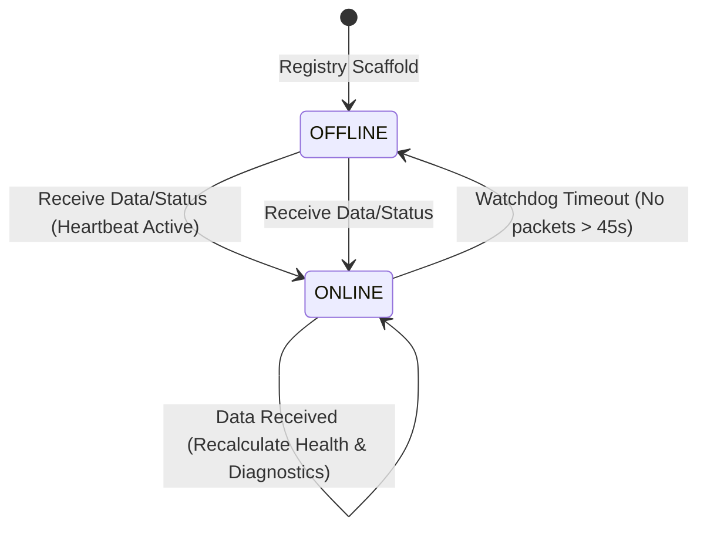
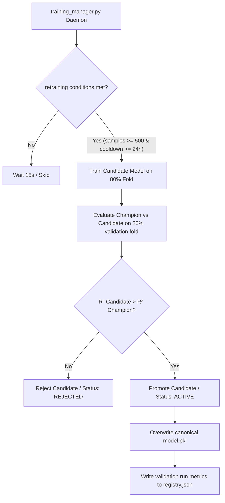
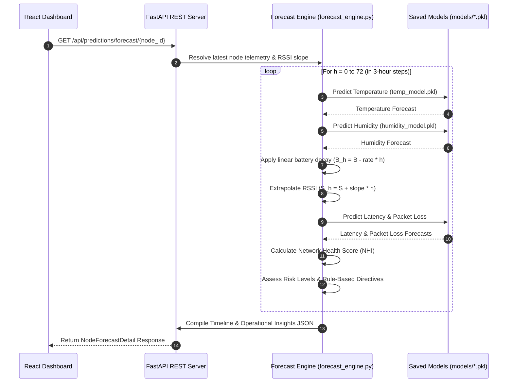
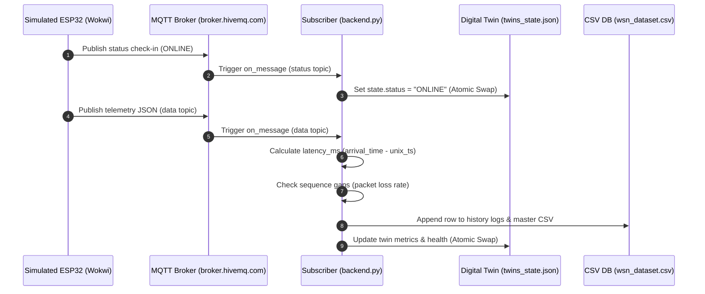

# System Architecture & Technical Specifications

This document defines the architectural blueprint, data flow designs, sequence interactions, and communication schemas of the Intelligent Wireless Sensor Network (WSN) Platform.

---

## 1. System Layers Architecture

The platform enforces a decoupled, service-oriented architecture. Only the telemetry generation source changes across development phases; all downstream components remain identical.

```text
┌────────────────────────────────────────────────────────────────────────┐
│                        1. TELEMETRY SOURCE LAYER                       │
│  - Phase 1: Python Virtual Processes (OpenWeather API seed)             │
│  - Phase 2: Virtual ESP32 microcontrollers inside Wokwi Browser Sandbox│
│  - Phase 3: Physical ESP32 DevKitC v4 (C++ compilation target)          │
└───────────────────────────────────┬────────────────────────────────────┘
                                    │
                                    ▼ MQTT / TCP (Port 1883)
┌────────────────────────────────────────────────────────────────────────┐
│                        2. COMMUNICATION LAYER                          │
│  - Message transport over TCP via MQTT brokers                         │
│  - wsn_ahana_2026/<node_id>/data ➔ Telemetry JSON payload               │
│  - wsn_ahana_2026/<node_id>/status ➔ Heartbeat check-in packet         │
└───────────────────────────────────┬────────────────────────────────────┘
                                    │
                                    ▼ Socket Ingestion (paho-mqtt)
┌────────────────────────────────────────────────────────────────────────┐
│                      3. INGESTION & DATA LAYER                         │
│  - backend.py daemon subscribing to broker queues                      │
│  - Watchdog timers tracking check-in delays                            │
│  - CSV database (wsn_dataset.csv) and city log files                   │
│  - Digital Twin shared state (twins_state.json)                        │
└───────────────────────────────────┬────────────────────────────────────┘
                                    │
                                    ▼ Thread-safe Atomic JSON Bridge
┌────────────────────────────────────────────────────────────────────────┐
│                 4. REST GATEWAY & MLOPS RETRAINING                     │
│  - FastAPI REST Gateway (Uvicorn web host)                             │
│  - Continuous Learning retraining manager (training_manager.py)       │
│  - Serialized scikit-learn model files (models/*.pkl)                  │
└───────────────────────────────────┬────────────────────────────────────┘
                                    │
                                    ▼ HTTP / REST endpoints
┌────────────────────────────────────────────────────────────────────────┐
│                          5. PRESENTATION LAYER                         │
│  - React Single Page Application (Vite project)                        │
│  - NOC style dashboard (Mission Control, SVG Topology, MLOps, ODSS)    │
└────────────────────────────────────────────────────────────────────────┘
```

---

## 2. Component Responsibilities

### 2.1 Node Registry
*   **Location**: `configs/nodes_registry.json`
*   **Role**: Serves as the fleet directory. Maps hardware MAC addresses to geographical locations (cities), lat/lon coordinates, and sensor types.
*   **Decoupling Rationale**: Firmware does not know its city or coordinates; it simply reads its eFuse MAC and publishes it. The backend maps the MAC to the location on packet arrival.

### 2.2 Generic Firmware
*   **Location**: `firmware/`
*   **Role**: Written in embedded C++. Instantiates DHT22 and BMP180 sensor components, connects to Wi-Fi, synchronizes time via NTP, parses configurations via MQTT, and publishes JSON telemetry packets.

### 2.3 Ingestor Backend & Watchdog
*   **Location**: `src/backend.py`
*   **Role**: Subscribes to the MQTT broker, parses telemetry JSON structures, appends readings to database log files, monitors node heartbeats, and flags timeout timeouts (watchdog thresholds).

### 2.4 Digital Twin Manager
*   **Location**: `src/utils/digital_twin_manager.py` (Snapshots saved to `data/twins/twins_state.json`)
*   **Role**: Thread-safe in-memory twin engine. Translates asynchronous MQTT packets into a static JSON file store, enabling FastAPI processes to read live states without database contention.

### 2.5 ML Retraining Manager
*   **Location**: `src/ml/training_manager.py` (Registry maintained in `models/registry.json`)
*   **Role**: MLOps continuous learning coordinator. Runs as a background daemon, monitors dataset sizes, and runs retraining pipelines when trigger thresholds are met.

---

## 3. Communication Flows & Schema

### 3.1 MQTT Telemetry Schema (`wsn_ahana_2026/<node_id>/data`)
Nodes publish telemetry packages containing ambient weather and network diagnostics:
```json
{
  "node_id": "24:0a:c4:08:32:01",
  "seq": 42,
  "uptime": 1284,
  "battery_level": 98.40,
  "signal_strength": -64.0,
  "temp": 27.50,
  "humidity": 55.0,
  "pressure": 1012.00,
  "wind_speed": 4.50
}
```

### 3.2 MQTT Status Heartbeat Schema (`wsn_ahana_2026/<node_id>/status`)
Nodes publish status notifications every 20 seconds:
```json
{
  "node_id": "24:0a:c4:08:32:01",
  "status": "ONLINE",
  "firmware": "2.1.0"
}
```

---

## 4. Digital Twin Lifecycle

The twin transitions between state flags based on packet intervals:



---

## 5. Machine Learning & Forecasting Pipelines

### 5.1 Continuous Retraining Pipeline
Retraining is validation-gated. A candidate model is promoted to active champion only if it proves superior accuracy.



### 5.2 Prediction & Operational Decision Support Flow
The system processes forecasts autoregressively, feeding environmental and network projections into a deterministic decision engine.



---

## 6. Sequence Diagram: Live Data Ingestion



---

## 7. Deployment Configuration

The WSN platform operates as a hybrid stack containing local nodes, public routing buses, backend daemons, and client dashboards.

*   **Local Node Simulation**: C++ sketches run in browser sandboxes, communicating via virtual gateway access points.
*   **REST API Host**: Python environments running Uvicorn. Exposes REST gateways and hosts model serializations.
*   **NOC Frontend**: Vite single-page application served over local dev interfaces.
